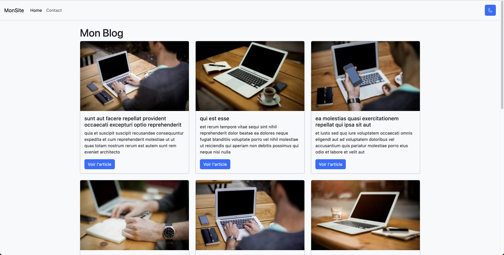

# Simple React Blog

[https://remimeullemeestre-simple-react-blog.netlify.app/](https://remimeullemeestre-simple-react-blog.netlify.app/)


## Description

The idea was to create a simple blog using only React core system, with minimum external libraries. Beside React and React Dom, there's React Error Boundary and React Bootstrap Icons.

The blog features a main page Home that display 10 posts fetched from JSONPlaceholder, and images from Lorem Picsum. Each post has it's own dedicated page, and can be edited and saved. The changes will be automatically updated in the UI. (no local storage or database, therefore any refresh will go bring back to its initial state). There's also a theme toggle button, and a Contact page, just for the demonstration of basic routing system (without React Router Dom).

[](https://remimeullemeestre-simple-react-blog.netlify.app/)

## Stack

- [React.js](https://react.dev/) - The library for web and native user interfaces. Build user interfaces out of individual pieces called components written in JavaScript. React is designed to let you seamlessly combine components written by independent people, teams, and organizations.
- [Vite](https://vitejs.dev/) - A fast and flexible frontend tooling that supports TypeScript, JSX, CSS and more. It offers instant server start, hot module replacement, rich features, optimized build, universal plugins and fully typed APIs.
- [Bootstrap](https://getbootstrap.com/) - A powerful, extensible, and feature-packed frontend toolkit for building fast and responsive sites. Learn how to customize, include, and use Bootstrap with Sass, CSS variables, CSS classes, and JavaScript plugins.


## Project structure

```
$PROJECT_ROOT
│   # Static files for assets
├── public
│   # Source folder
└──src
    │   # React component files
    ├── components
    │   # Custom hook files
    ├── hooks
    │   # Page files
    ├── page
    │   # Reusable functions across the project
    └── utils
```

## Potential improvements

- **Pagination** - Adding a pagination for the Home page.
- **React Router Dom** - In order to get a solid routing system and get post by slug for instance rather than id.
- **React Query** - To cache the data already fetched.
- **Back-end** - Creating and fetching the data from a dedicated back-end.